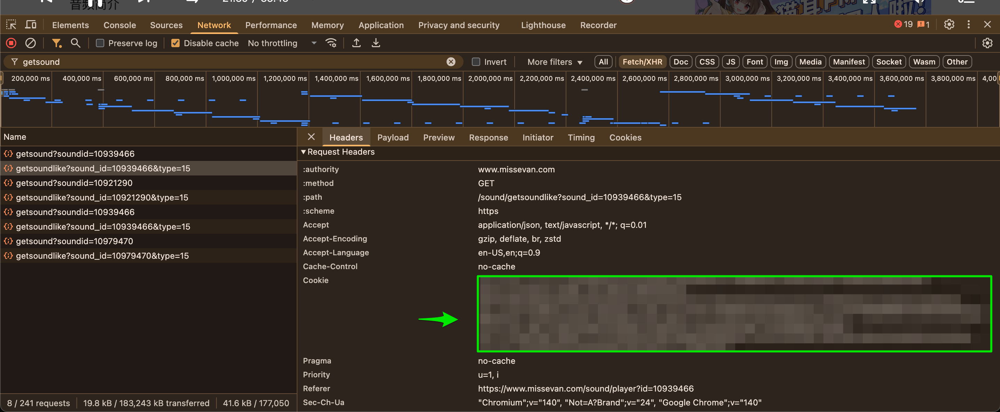

# Intro

This project is capable of extracting the audio files and subtitles from audiobooks on the site `missevan.com`.

# Set up

## Install on your machine

### Mac OS

Install the following:

- [Homebrew](https://brew.sh/)
- [pipx](https://github.com/pypa/pipx)
- [poetry](https://python-poetry.org/docs/#installing-with-pipx)

```
# From Terminal
/bin/bash -c "$(curl -fsSL https://raw.githubusercontent.com/Homebrew/install/HEAD/install.sh)"
brew install pipx
pipx install poetry
```

## Download your cookie

- Log in to your account
- Navigate to any audio drama
- Make a copy of your cookie using your browser's dev tools on any Fetch/XHR call (See below)
- Save the cookie to a file called `cookie_copy` in the same directory as main.py

## Run the content downloader

### Mac OS

```
# Using Poetry
eval $(poetry env activate)
python main.py <episode_number>

# For additional subtitle data
python subs.py <episode_number>
```

You will need python and git installed

- Clone this repository to your PC
- Open a command prompt
- Create a virtual environment with `python -m venv .venv`
- Install dependencies with `.venv/bin/pip install -r requirements.txt`

# How to find your cookie

This can be done in any browser.

## Chrome

- Log in to `missevan.com` in a browser, as usual
- Press F12 to bring up the developer console
- Find the `Network` tab at the top of the console
- In the `Filter` bar, type `getsound`
- In the lefthand side, click on any of the lines and open the `Request` tab
- Scroll down the the Request Headers to where it says `Cookie`
- Select the entire content of the Cookie line, save it to a file named `cookie_copy`
- Edit the file `main.py` and put both these values in the respective places marked with `TODO`


_Screenshot showing how to find the cookie in Chrome developer tools_

# Notes about downloads

All content will be in the `SavedDramas` directory in the following format:

```
Saved Dramas
|__<Drama Title>
  |__ <Episode ID>
    |__ <Episode Name>.m4a
    |__ <Episode Name>.html
    |__ <Episode Name>.txt
    |__ <Episode Name>.jpg
  |__ <Episode ID>
     |_ ...
```

Subtitles will be a combination of HTML files (raw downloaded content) and TXT files (The barrage-filtered subtitles).

Images should be the per-episode cover images.
